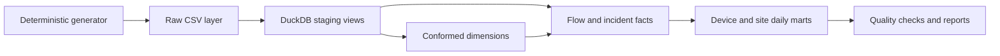
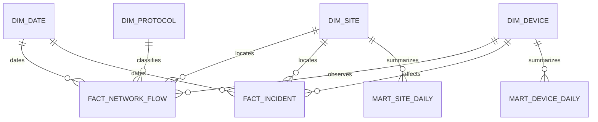

# Network Telemetry Warehouse


A reproducible analytical warehouse that converts network-flow telemetry into governed dimensions, facts and daily service-quality marts. The project links hands-on network knowledge to data engineering: event-time joins, SCD2 history, explicit table grain, automated reconciliation and operational KPIs.

**Author:** João Pedro de Moura Lima

## Executive summary

The default pipeline simulates 2026 Q1 with a fixed seed and contains no production data or personal information. It generates 120,000 flows across 80 devices and 4 fictional sites, then materializes a DuckDB warehouse with two fact tables, four conformed dimensions and two marts.

Key results from the deterministic build:

- **120,000 / 120,000 flows** and **220 / 220 incidents** reconciled from raw input to facts;
- **zero** primary-key, orphan-key, invalid-bound, multiple-current-row or SCD2 overlap failures;
- **35.37 ms** overall P95 latency and **0.86%** mean packet loss across **0.1467 TB** of simulated traffic;
- **39.37 ms** mean latency on device incident days versus **16.46 ms** on clean days, a **139.2% lift** that recovers the generator's known degradation signal.

The metrics above were also reproduced with the independent Pandas reference in `tools/reference_report.py`; the DuckDB build remains the system of record and overwrites the same report artifacts.

## Architecture





`dim_device` is type-2 slowly changing. Facts join to the unique version whose half-open interval `[valid_from, valid_to)` contains the event timestamp, preserving historical firmware context.

## Data model

| Table | Grain | Purpose |
|---|---|---|
| `dim_date` | one calendar day | reusable date attributes |
| `dim_site` | one fictional site | region and nominal bandwidth |
| `dim_protocol` | one protocol | port and traffic class |
| `dim_device` | one device version | SCD2 firmware and ownership history |
| `fact_network_flow` | one observed flow | traffic, throughput, latency and loss |
| `fact_incident` | one incident | severity, category and downtime |
| `mart_device_daily` | device × day | service quality and saturation |
| `mart_site_daily` | site × day | operational monitoring KPIs |

## Data quality gates

The build fails on:

- duplicate fact primary keys;
- orphan device, site or protocol foreign keys;
- negative traffic, latency or out-of-range packet loss;
- anything other than one current SCD2 row per natural device key;
- overlapping SCD2 validity intervals;
- any difference between raw and warehouse fact row counts.

Results are persisted in [`reports/data_quality.json`](reports/data_quality.json), not just printed to a terminal.

## Reproduce

```bash
python -m venv .venv
source .venv/bin/activate
pip install -r requirements.txt
python -m src.generate_data
python -m src.build_warehouse
python tools/create_notebook.py
python tools/validate_notebook.py
pytest -q
```

Open [`notebooks/01_warehouse_analysis.ipynb`](notebooks/01_warehouse_analysis.ipynb) for the reader-facing analysis. Raw CSVs and the DuckDB database are intentionally excluded because both are deterministic build artifacts.

## Repository layout

```text
data/          reproducible raw-layer contract
notebooks/     reader-facing analytical narrative
reports/       versioned KPIs, quality evidence and figures
sql/           dimensions, facts, marts and quality checks
src/           deterministic generator and warehouse build
tests/         generator, SCD2 and end-to-end tests
warehouse/     local DuckDB output
```

## Scope and limitations

The generator embeds a known incident-day degradation signal so the modeling path can be verified. It is not a capacity forecast, packet-capture parser or production monitoring system. Thresholds and service-quality weights are illustrative and must be replaced with service-specific SLOs before operational use.

## License

MIT © 2026 João Pedro de Moura Lima
